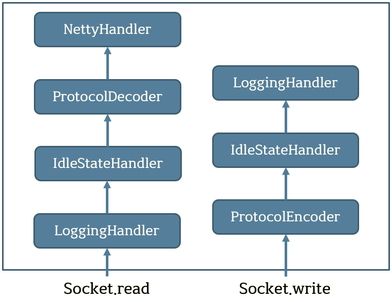

# NettyClientDemo
메시지를 입력하여 그에 맞는 콜백들을 확인

## 설명
- NettyClientInitializer 클래스에서 ChannelPipeLine에 핸들러 추가 부분 
**- ChannelPipeLine 핸들러 이벤트 순서**

좌측은 소켓을 읽을 때에 발생하는 헨들러 이벤트 순서 
우측은 소켓을 쓸 때에 발생하는 핸들러 이벤트 순서

## Language
- [Java](https://www.oracle.com/java/index.html)

## Framework
- [Netty](https://netty.io)

## Libraries
- [Gson](https://github.com/google/gson)
- [Butterknife](http://jakewharton.github.io/butterknife/)